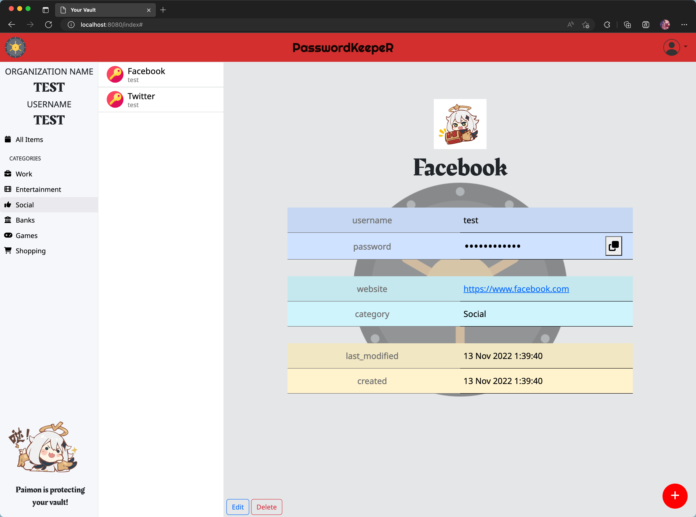
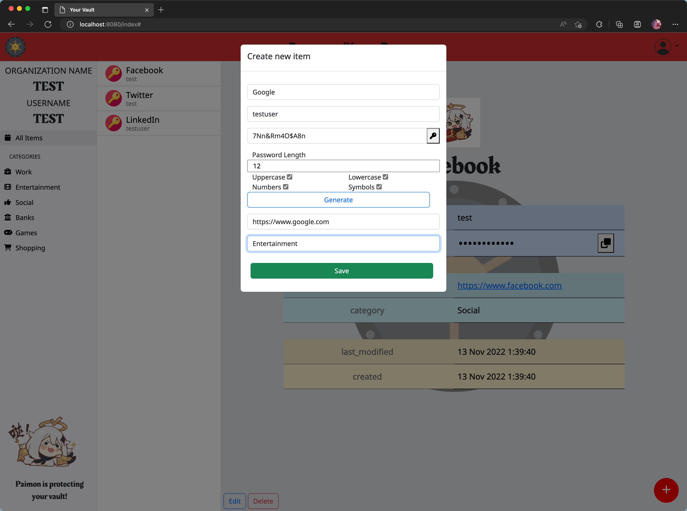
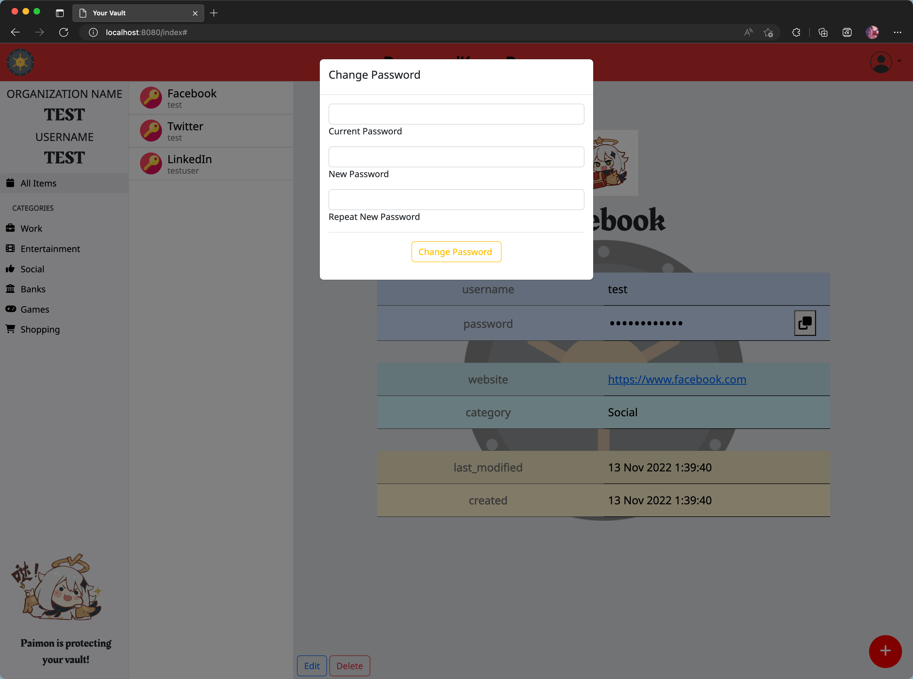

# PasswordKeepeR

PasswordKeepeR is a full stack web application built with Node, Express, jQuery, and PostgreSQL that allows users to store passwords for organizations.

## Feature

- JWT token is used to store user credentials
- User can register/login and be assigned to an organization
- User's vault passwords are stored in the database with bcrypt hashing algorithm
- Users can access to credentials stored by other users in the same organization
- User can add a new username and password for a specific website
- App can generate passwords based on the criteria specified (password length, contains lowercase, contains uppercase, contains numbers, etc)
- User can edit and change their password any time
- User can change their vault password
- User has a convenient copy to clipboard button so they don't have to select the password
- Sites can be categorized, to, social (fb, linkedin), work related (bamboo, harvest), entertainment (snapchat, reddit), etc
- User's vault data can only being accessed by using user's password, and render data locally. No data being stored or accessed in the server side

## Screenshots

### Login page

### Main User Interface

### View passwords by categories

### Password Generator

### User password change

## Dependencies

- Node.js
- bcryptjs
- cookie-parser
- cookie-session
- ejs
- express
- jsonwebtoken
- sass
- method-override
- pg

## Getting Started

1. Create the `.env` by using `.env.example` as a reference: `cp .env.example .env`
2. Update the .env file with your correct local information

3. Install dependencies: `npm i`
4. Fix to binaries for sass: `npm rebuild node-sass`
5. Reset database: `npm run db:reset`

- Check the db folder to see what gets created and seeded in the SDB

7. Run the server: `npm run local`

- Note: nodemon is used, so you should not have to restart your server

8. Visit `http://localhost:8080/`
